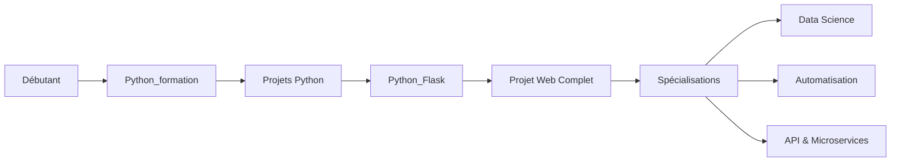

# 🐍 Formation Python Complète

> **Apprenez Python de zéro jusqu'au développement web professionnel**

[](https://www.python.org/)
[](https://flask.palletsprojects.com/)
[](LICENSE)

---

## 📚 À propos de cette formation

Cette formation complète vous guidera à travers l'apprentissage de Python, depuis les **concepts fondamentaux** jusqu'au **développement d'applications web** professionnelles avec Flask.

**🎯 Objectifs de la formation :**
- Maîtriser les bases et concepts avancés de Python
- Développer des applications web complètes
- Comprendre les bases de données et l'authentification
- Créer des API REST
- Déployer des applications en production

**👥 Public visé :**
- Débutants en programmation
- Développeurs souhaitant apprendre Python
- Étudiants en informatique
- Professionnels en reconversion

---

## 🗂️ Organisation du Repository

Ce repository est organisé en **branches thématiques** pour une meilleure organisation :

### 📖 Branches Disponibles

| Branch | Description | Niveau | Durée estimée |
|--------|-------------|--------|---------------|
| **[`Python_formation`](#-python_formation)** | Fondamentaux Python (variables, boucles, POO, etc.) | Débutant | 40-60 heures |
| **[`Python_Flask`](#-python_flask)** | Développement web avec Flask | Intermédiaire | 30-40 heures |

---

## 🎓 Python_formation

**Branch:** `Python_formation`

### 📋 Contenu

Cette branche couvre **tous les concepts fondamentaux de Python** nécessaires pour devenir un développeur Python compétent.

#### Modules inclus :

1. **Introduction et Histoire de Python**
   - Origine et philosophie du langage
   - Installation et environnement de développement
   - Premier programme

2. **Syntaxe de Base**
   - Variables et types de données
   - Opérateurs (arithmétiques, logiques, comparaison)
   - Structures conditionnelles (if/elif/else)
   - Boucles (for, while)

3. **Structures de Données**
   - Listes et manipulation
   - Tuples et immutabilité
   - Dictionnaires (clé-valeur)
   - Sets (ensembles)
   - Chaînes de caractères avancées

4. **Fonctions et Modularité**
   - Définition et appel de fonctions
   - Paramètres et valeurs de retour
   - Portée des variables
   - Fonctions lambda
   - Décorateurs (introduction)

5. **Modules et Packages**
   - Import de modules
   - Modules standards (math, random, datetime, os)
   - Création de modules personnalisés
   - Gestion de packages avec pip

6. **Gestion des Fichiers**
   - Lecture et écriture de fichiers
   - Formats CSV et JSON
   - Manipulation de fichiers
   - Context managers (with)

7. **Gestion des Erreurs**
   - Try/except/finally
   - Types d'exceptions
   - Création d'exceptions personnalisées
   - Bonnes pratiques

8. **Programmation Orientée Objet**
   - Classes et objets
   - Attributs et méthodes
   - Héritage et polymorphisme
   - Encapsulation
   - Méthodes spéciales (magic methods)

### 🎯 Livrables

- ✅ **16 chapitres complets** avec théorie et exemples
- ✅ **16 exercices pratiques** progressifs
- ✅ **Solutions détaillées** pour tous les exercices
- ✅ **3 projets complets** (gestionnaire de journal, système bancaire, bibliothèque)

### 🚀 Comment commencer ?

```bash
# Cloner uniquement la branche Python_formation
git clone -b Python_formation --single-branch [URL_DU_REPO]
cd [NOM_DU_REPO]

# Ou si vous avez déjà cloné le repo
git checkout Python_formation
```

### 📖 Prérequis

- Aucune connaissance préalable en programmation
- Un ordinateur (Windows, Mac ou Linux)
- Python 3.11+ installé

---

## 🌐 Python_Flask

**Branch:** `Python_Flask`

### 📋 Contenu

Cette branche vous apprend à créer des **applications web complètes** avec le framework Flask.

#### Modules inclus :

1. **Introduction au Développement Web**
   - Architecture client-serveur
   - Protocole HTTP
   - Flask vs autres frameworks

2. **Fondamentaux Flask**
   - Installation et configuration
   - Routing et URLs dynamiques
   - Gestion des méthodes HTTP
   - Redirections et erreurs

3. **Templates avec Jinja2**
   - Syntaxe Jinja2
   - Héritage de templates
   - Filtres et macros
   - Templates réutilisables

4. **Formulaires**
   - Formulaires HTML
   - Flask-WTF et validation
   - Upload de fichiers
   - Messages flash

5. **Bases de Données**
   - SQLite et SQLAlchemy
   - Modèles et relations
   - CRUD complet
   - Migrations

6. **Authentification et Sessions**
   - Flask-Login
   - Hash de mots de passe
   - Sessions utilisateur
   - Protection de routes

7. **Fichiers Statiques**
   - CSS et JavaScript
   - Images et assets
   - Frameworks CSS (Bootstrap, Tailwind)

8. **API REST**
   - Création d'API
   - JSON et sérialisation
   - Authentification JWT
   - CORS et sécurité

9. **Déploiement**
   - Préparation à la production
   - Heroku
   - Docker
   - Variables d'environnement

### 🎯 Livrables

- ✅ **10 chapitres complets** (théorie + pratique)
- ✅ **10 exercices guidés**
- ✅ **1 projet complet** : Blog avec authentification, commentaires, catégories
- ✅ **Code source complet** du projet
- ✅ **Templates HTML/CSS/JS** prêts à l'emploi

### 🚀 Comment commencer ?

```bash
# Cloner uniquement la branche Python_Flask
git clone -b Python_Flask --single-branch [URL_DU_REPO]
cd [NOM_DU_REPO]

# Ou si vous avez déjà cloné le repo
git checkout Python_Flask

# Installer les dépendances
pip install -r requirements.txt

# Lancer le projet exemple
python app.py
```

### 📖 Prérequis

- ✅ Avoir complété la formation Python de base
- Connaître HTML/CSS (bases)
- Python 3.11+ installé
- Un éditeur de code (VS Code recommandé)

---

## 🛣️ Parcours d'Apprentissage Recommandé



### 📅 Planning suggéré

| Semaine | Module | Temps/jour |
|---------|--------|------------|
| 1-6 | Python_formation (bases) | 2h |
| 7-8 | Python_formation (POO + projets) | 3h |
| 9-12 | Python_Flask (fondamentaux) | 2h |
| 13-14 | Python_Flask (projet complet) | 3h |

---

## 🎓 Compétences Acquises

À la fin de cette formation complète, vous serez capable de :

### Python Général
- ✅ Écrire du code Python propre et idiomatique
- ✅ Utiliser les structures de données efficacement
- ✅ Gérer les erreurs et exceptions
- ✅ Créer des programmes orientés objet
- ✅ Manipuler des fichiers et données
- ✅ Utiliser les modules standards et externes

### Développement Web
- ✅ Créer des applications web avec Flask
- ✅ Gérer l'authentification et les sessions
- ✅ Interagir avec des bases de données
- ✅ Créer des API REST
- ✅ Déployer des applications en production
- ✅ Sécuriser vos applications

---

## 💼 Projets Inclus

### 🗂️ Projets Python de Base

1. **Générateur de Mots de Passe**
   - Génération sécurisée
   - Évaluation de force
   - Sauvegarde chiffrée

2. **Gestionnaire de Journal Intime**
   - Entrées avec tags
   - Recherche et filtrage
   - Export en différents formats
   - Statistiques

3. **Système Bancaire**
   - Gestion de comptes
   - Transactions sécurisées
   - Historique complet
   - Gestion d'erreurs avancée

4. **Bibliothèque**
   - Gestion de livres physiques et numériques
   - Système de membres
   - Emprunts et retours
   - Statistiques complètes

### 🌐 Projet Web Flask

**Blog Complet** avec :
- 👤 Authentification (inscription, connexion, profils)
- 📝 CRUD d'articles avec éditeur
- 💬 Système de commentaires
- 🏷️ Catégories et tags
- 🔍 Recherche avancée
- 📊 Dashboard utilisateur
- 🎨 Interface moderne (Bootstrap)
- 🔐 Sécurité et validation
- 🚀 Prêt pour le déploiement

---

## 📦 Installation Générale

### Prérequis Système

- **Python 3.11+** ([Télécharger](https://www.python.org/downloads/))
- **Git** ([Télécharger](https://git-scm.com/downloads))
- **Éditeur de code** (VS Code recommandé)

### Installation Python

#### Windows
```bash
# Télécharger depuis python.org
# Cocher "Add Python to PATH" lors de l'installation

# Vérifier l'installation
python --version
pip --version
```

#### macOS
```bash
# Avec Homebrew
brew install python@3.11

# Vérifier l'installation
python3 --version
pip3 --version
```

#### Linux (Ubuntu/Debian)
```bash
sudo apt update
sudo apt install python3.11 python3-pip

# Vérifier l'installation
python3 --version
pip3 --version
```

### Cloner le Repository

```bash
# Cloner tout le repository
git clone [URL_DU_REPO]
cd [NOM_DU_REPO]

# Voir toutes les branches
git branch -a

# Changer de branche
git checkout Python_formation
# ou
git checkout Python_Flask
```

---

## 🛠️ Outils Recommandés

### Éditeurs de Code
- **[Visual Studio Code](https://code.visualstudio.com/)** (recommandé)
  - Extension : Python
  - Extension : Pylance
  - Extension : Flask Snippets
- **[PyCharm Community](https://www.jetbrains.com/pycharm/)** (alternatif)

### Outils de Développement
- **[Git](https://git-scm.com/)** - Contrôle de version
- **[Postman](https://www.postman.com/)** - Tests d'API
- **[DB Browser for SQLite](https://sqlitebrowser.org/)** - Visualiser les bases de données

---

## 📚 Ressources Supplémentaires

### Documentation Officielle
- [Python Documentation](https://docs.python.org/3/)
- [Flask Documentation](https://flask.palletsprojects.com/)
- [SQLAlchemy Documentation](https://docs.sqlalchemy.org/)
- [Jinja2 Documentation](https://jinja.palletsprojects.com/)

### Livres Recommandés
- **"Python Crash Course"** par Eric Matthes
- **"Fluent Python"** par Luciano Ramalho
- **"Flask Web Development"** par Miguel Grinberg

### Communautés
- [r/learnpython](https://www.reddit.com/r/learnpython/) - Reddit
- [Python Discord](https://pythondiscord.com/) - Serveur Discord
- [Stack Overflow](https://stackoverflow.com/questions/tagged/python) - Q&A

### Tutoriels Vidéo
- [Corey Schafer - Python Tutorials](https://www.youtube.com/c/Coreyms)
- [Tech With Tim](https://www.youtube.com/c/TechWithTim)
- [freeCodeCamp](https://www.youtube.com/c/Freecodecamp)

---

## 🤝 Contribution

Les contributions sont les bienvenues ! Si vous souhaitez améliorer cette formation :

1. **Fork** le projet
2. Créez une **branche** pour votre fonctionnalité (`git checkout -b feature/amelioration`)
3. **Committez** vos changements (`git commit -m 'Ajout d'une amélioration'`)
4. **Push** vers la branche (`git push origin feature/amelioration`)
5. Ouvrez une **Pull Request**

### Types de contributions appréciées
- 🐛 Corrections de bugs ou typos
- 📝 Amélioration de la documentation
- ✨ Nouveaux exercices ou projets
- 💡 Suggestions d'amélioration

---

## ❓ FAQ

### **Q: Combien de temps faut-il pour terminer la formation ?**
**R:** Comptez environ 70-100 heures au total, réparties sur 3-4 mois à raison de 2-3h par jour.

### **Q: Dois-je suivre les branches dans un ordre précis ?**
**R:** Oui, il est fortement recommandé de commencer par `Python_formation` avant `Python_Flask`.

### **Q: Les solutions des exercices sont-elles disponibles ?**
**R:** Oui, toutes les solutions sont fournies dans chaque branche respective.

### **Q: Puis-je utiliser ce contenu pour enseigner ?**
**R:** Oui, ce contenu est sous licence MIT. Vous pouvez l'utiliser, le modifier et le distribuer librement.

### **Q: Y aura-t-il d'autres modules (Data Science, etc.) ?**
**R:** C'est prévu ! D'autres branches seront ajoutées progressivement.

### **Q: Le contenu est-il à jour ?**
**R:** Oui, le contenu est régulièrement mis à jour avec les dernières versions de Python et Flask.

---

## 📞 Support et Contact

- 📧 **Email :** [VOTRE_EMAIL]
- 💬 **Discord :** [LIEN_SERVEUR_DISCORD]
- 🐦 **Twitter :** [VOTRE_TWITTER]
- 💼 **LinkedIn :** [VOTRE_LINKEDIN]

---

## 📜 Licence

Ce projet est sous licence **MIT** - voir le fichier [LICENSE](LICENSE) pour plus de détails.

---

## 🌟 Remerciements

Un grand merci à :
- La communauté Python pour ses ressources inestimables
- Les mainteneurs de Flask et SQLAlchemy
- Tous les contributeurs de ce projet
- Vous, pour avoir choisi cette formation !

---

## 🚀 Commencer Maintenant

Prêt à devenir un développeur Python ? Choisissez votre chemin :

```bash
# Pour les débutants complets
git checkout Python_formation

# Pour ceux qui connaissent déjà Python
git checkout Python_Flask
```

**Bon apprentissage ! 🐍💻**

---

<div align="center">

**⭐ Si cette formation vous aide, n'hésitez pas à mettre une étoile au projet ! ⭐**

Made with ❤️ and Python

</div>
